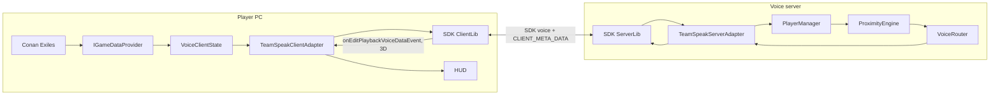
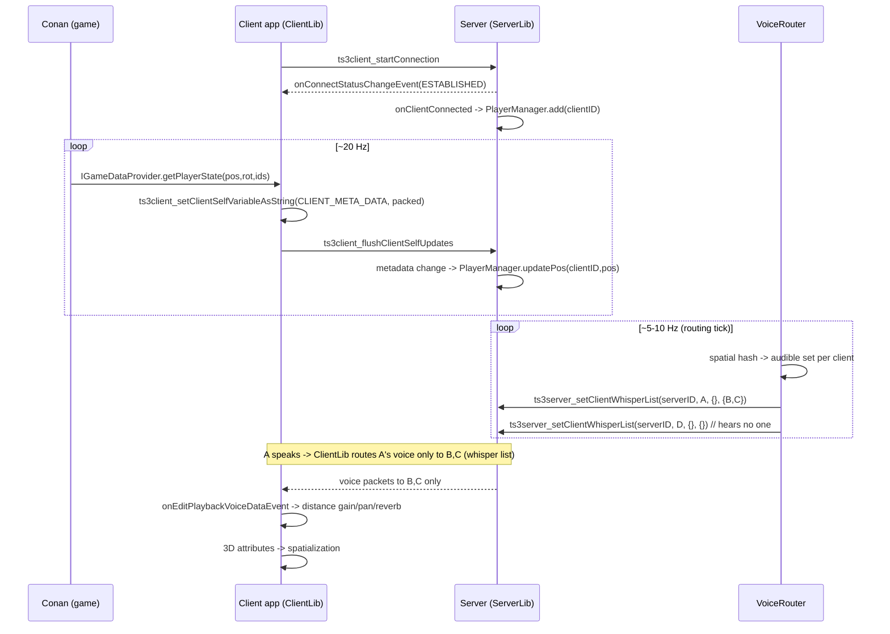

# Conan Voice on TeamSpeak 3 SDK (ClientLib + ServerLib) — Development-Ready Plan

New product, new branch `ts3-Testing`. The V8 retail plugin on `tsmain` stays intact and is reused for *logic* only.

> Items marked **[VERIFY]** are exact names/signatures to confirm against `serverlib.h` / `clientlib.h` and the bundled API reference during Phase 0. Everything unmarked is confirmed from TeamSpeak docs/examples.

---

## 0. The two SDKs (why this is a real switch, not a rename)

| | Client Plugin SDK (today, V8) | TeamSpeak 3 SDK (this plan) |
|---|---|---|
| Header(s) | `ts3_functions.h` (`TS3Functions`) | `clientlib.h` + `serverlib.h` |
| Function family | `ts3plugin_*` callbacks | `ts3client_*` and `ts3server_*` |
| Who hosts voice | retail `ts3server` | **our** `conan-voice-server` process |
| Who runs the client | retail TeamSpeak app loads our DLL | **our** app embeds ClientLib |
| Can decide who hears whom | no (edit local PCM only) | **yes** (`ts3server_setClientWhisperList`) |
| License | free | paid; free evaluation for dev |
| Interop | plugin only talks to retail TS | SDK client only talks to SDK server (`0x0705` otherwise) |

Proof today is Plugin SDK: `sdk/README.md` line 1 = "TeamSpeak 3 Client Plugin SDK"; repo has `ts3plugin_*`, no `ts3client_*`/`ts3server_*`.

**Consequence:** the "Conan Voice Client" is a standalone ClientLib app (users run it like the Mumble client), not retail TeamSpeak + plugin.

---

## 1. Component overview



---

## 2. Server process — exact lifecycle

File: `server/src/main.c` (+ `server/src/ts_server_adapter.c`).

Startup order (each step checks the return code with `ts3server_getGlobalErrorMessage` on failure):

```text
1. load config (server/config/*.ini)          -> our Config module
2. start logger                                -> our Logging module
3. fill ServerLibFunctions (memset 0, assign callbacks)
4. ts3server_initServerLib(&funcs, LogType_FILE|LogType_CONSOLE, logDir)
5. ts3server_createServerKeyPair(...) OR load stored keypair   [VERIFY exact name]
6. ts3server_createVirtualServer(port, "0.0.0.0", name, keyPair, maxClients, &serverID)
7. init Voice backend (PlayerManager, ProximityEngine, VoiceRouter)
8. run event loop (routing tick; SDK callbacks fire on SDK threads)
9. shutdown: ts3server_stopVirtualServer(serverID)
             ts3server_destroyServerLib()
```

Confirmed signatures:

- `unsigned int ts3server_initServerLib(const struct ServerLibFunctions* funcs, int usedLogTypes, const char* logFileFolder);`
- `unsigned int ts3server_createVirtualServer(unsigned int serverPort, const char* serverIp, const char* serverName, const char* serverKeyPair, unsigned int serverMaxClients, uint64* result);`
- `unsigned int ts3server_stopVirtualServer(uint64 serverID);`
- `unsigned int ts3server_destroyServerLib(void);`
- Routing: `unsigned int ts3server_setClientWhisperList(uint64 serverID, anyID clientID, const uint64* channelIDs, const anyID* clientIDs);`
- Enumerate: `ts3server_getClientList(serverID, anyID** result)`, `ts3server_getChannelList(serverID, uint64** result)`, free with `ts3server_freeMemory(ptr)`.

Callbacks we register in `ServerLibFunctions` (assign only what we use):

- `onClientConnected(serverID, clientID, channelID, ...)` **[VERIFY arg list]** -> PlayerManager.add
- `onClientDisconnected(serverID, clientID, channelID, ...)` -> PlayerManager.remove + clear whisper list
- `onClientMoved(serverID, clientID, oldCh, newCh, ...)`
- `onServerTextMessageEvent` / `onChannelTextMessageEvent` -> fallback game-data channel (see 5)
- `onClientStartTalkingEvent` / `onClientStopTalkingEvent` -> HUD "who speaks" hints
- `onUserLoggingMessageEvent` -> our logger
- `onAccountingErrorEvent` -> license/slot errors (must handle for eval license)

---

## 3. Client app — exact lifecycle

File: `client/src/main.c` (+ `client/src/ts_client_adapter.c`, `client/src/game_provider_*.c`).

```text
1. fill ClientUIFunctions (callbacks) 
2. ts3client_initClientLib(&clientFuncs, NULL, LogType_FILE, NULL, resourcesPath)  [VERIFY arg list]
3. ts3client_spawnNewServerConnectionHandler(0, &scHandlerID)
4. identity: load stored, else ts3client_createIdentity(&id) then persist
5. ts3client_openPlaybackDevice(scHandlerID, "", "")   // default device
   ts3client_openCaptureDevice(scHandlerID, "", "")
6. ts3client_startConnection(scHandlerID, identity, host, port,
                             nickname, NULL/*default channel*/, "", serverPassword)
7. wait for onConnectStatusChangeEvent == STATUS_CONNECTION_ESTABLISHED
8. loop: push game data (see 5), set 3D (see 6), render HUD
9. shutdown: ts3client_stopConnection(scHandlerID, "leaving")
             ts3client_destroyServerConnectionHandler(scHandlerID)
             ts3client_destroyClientLib()
```

Confirmed:

- `ts3client_startConnection(scHandlerID, identity, ip, port, nickname, defaultChannelArray, defaultChannelPassword, serverPassword)`
- `ts3client_stopConnection(scHandlerID, quitMessage)`
- `ts3client_getConnectionStatus(scHandlerID, int* result)`
- Callback `onConnectStatusChangeEvent(scHandlerID, newStatus, errorNumber)`; `onServerStopEvent(scHandlerID, shutdownMessage)`.

ClientLib callbacks we implement: `onConnectStatusChangeEvent`, `onNewChannelEvent`, `onClientMoveEvent`, `onTalkStatusChangeEvent`, `onServerStopEvent`, `onEditPlaybackVoiceDataEvent` (local audio effects: reverb/lowpass reuse from V8), `onCustom3dRolloffCalculationClientEvent` (custom distance curve). **[VERIFY exact callback names in clientlib.h]**

---

## 4. Data flow: connect -> position -> routing -> voice



Whisper-list routing detail (from TeamSpeak Whisper Lists example): a client with a whisper list bypasses normal channel voice and sends **only** to the listed clients/channels. So the router expresses the full audible matrix as per-speaker client-ID lists. Clearing = `ts3server_setClientWhisperList(serverID, client, NULL, NULL)`.

Caveat to design around: while a client has an active whisper list, its **normal channel talk is disabled**. Therefore ALL proximity/radio/whisper voice must be expressed through whisper lists (do not mix with channel voice for routed players).

---

## 5. Game-data transport (the previously-missing piece)

Requirement: client must tell the server its position ~20 Hz **without an external HTTP/REST/WebSocket API** (user constraint). Two in-SDK mechanisms:

- **Primary: `CLIENT_META_DATA`** (string, up to 4096 bytes, Read/Write).
  - Client: `ts3client_setClientSelfVariableAsString(scHandlerID, CLIENT_META_DATA, packedState)` then `ts3client_flushClientSelfUpdates(scHandlerID, NULL)`.
  - Server: read with `ts3server_getClientVariableAsString(serverID, clientID, CLIENT_META_DATA, &out)` **[VERIFY server-side getter + whether a change event fires; if no push event, poll on the routing tick]**.
  - Payload = compact base64/binary: `playerId,charId,x,y,z,yaw,voiceMode,flags,seq` (reuse V8 CEPOS packing idea, rewritten).
- **Fallback: text messages** `TextMessageTarget_SERVER` -> server `onServerTextMessageEvent`. Heavier; use only for discrete events (RADIO_JOIN, WHISPER_START) if metadata proves too slow.

Small control protocol (carried over the chosen mechanism): `HELLO, AUTH, AUTH_RESULT, POSITION, VOICE_STATE, RADIO_JOIN/LEAVE, WHISPER_START/STOP, CONFIG, PING/PONG` (from v2 draft, kept).

---

## 6. 3D voice

Server feeds authoritative positions; **client** applies 3D locally via ClientLib 3D API **[VERIFY exact names]**:

- Listener (self): `ts3client_systemset3DListenerAttributes(scHandlerID, &posSelf, &forward, &up)`
- Per remote speaker: `ts3client_channelset3DAttributes(scHandlerID, remoteClientID, &posRemote)` (or `ts3client_set3DWaveAttributes`) 
- Custom rolloff: implement `onCustom3dRolloffCalculationClientEvent` to match Conan voice ranges.
- Vectors use `TS3_VECTOR {float x,y,z}`.

We do NOT build a voice engine; TeamSpeak does encode/decode/transport/spatialize.

---

## 7. Module map (server + client) with the APIs each owns

Server (`server/src/`):
- `ts_server_adapter` — the ONLY file calling `ts3server_*`. Exposes `ITeamSpeakServer` (connectClient/disconnect/getClientState/setWhisperList/getClientMeta/moveClient).
- `player_manager` — `VoicePlayer{tsClientId, conanPlayerId, characterId, pos, voiceMode, authenticated}`; add/remove on connect/disconnect; updatePos from metadata.
- `proximity_engine` — spatial grid (cells), neighbor query, distance -> audible; reuse V8 `proximity_math`/`zone_resolve` logic (rewrite).
- `voice_router` — merges proximity + radio + whisper + global + permissions -> per-client target list -> `ITeamSpeakServer.setWhisperList`; routing cache + hysteresis.
- `auth` — SDK identity -> Conan player mapping via short-lived token.
- `radio_manager`, `whisper_manager`, `permissions` — logical groups.
- `config`, `logging`.

Client (`client/src/`):
- `ts_client_adapter` — the ONLY file calling `ts3client_*`. Exposes `ITeamSpeakClient`.
- `game_provider` — implements `IGameDataProvider` (file/IPC, ported from Mumble/V8 `pos_file`).
- `voice_client_state`, `audio_effects` (reuse V8 reverb/lowpass in `onEditPlaybackVoiceDataEvent`), `hud`, `config`, `logging`.

Shared (`shared/`): `protocol/` (message + meta-data packing), `types/` (Vector3, PlayerId, VoiceMode), `config/`.

---

## 8. Threading model

- **SDK callback threads:** `ts3server_*` / `ts3client_*` callbacks fire on SDK-owned threads. Keep them short; hand off to our queues. (Same discipline as V8's callback-thread rule, but now applied to SDK callbacks.)
- **Routing tick thread (server):** 5-10 Hz; reads player snapshots, computes audible sets, calls `setClientWhisperList`. Never blocks on game I/O.
- **Game provider thread (client):** ~20-30 Hz reads Conan position; publishes snapshot; the flush to metadata happens on a controlled cadence.
- **Audio (client):** `onEditPlaybackVoiceDataEvent` — no locks, snapshot read only (reuse V8 PCM ownership pattern).

---

## 9. Repository layout (branch ts3-Testing)

```text
conan-voice/
├── client/  { src/ include/ CMakeLists.txt }
├── server/  { src/ include/ config/ CMakeLists.txt }
├── shared/  { protocol/ types/ config/ }
├── sdk/     { include/ lib/ bin/ examples/ }   # examples untouched
├── tests/   { unit/ integration/ load/ }
├── docs/
└── CMakeLists.txt   # SDK path configurable, no C:\Users\... hardcodes
```

Kept isolated from `src/` so the V8 DLL build is never disturbed and `tsmain` merges stay clean.

---

## 10. Phases (with concrete API deliverables)

**Phase 0 — SDK + license + API verification.** Get SDK (ClientLib+ServerLib) + evaluation license; build official ServerLib + ClientLib examples; confirm every **[VERIFY]** name against `serverlib.h`/`clientlib.h`. Exit: examples run; API list frozen.

**Phase 1 — server bootstrap (Milestone 1).** `main.c` runs steps 1-9 of section 2; start/stop/restart clean. No Conan, no routing.

**Phase 2 — client PoC + metadata.** ClientLib app connects (section 3); publishes `CLIENT_META_DATA`; server reads it. Two clients talk in one channel.

**Phase 3 — routing PoC (make-or-break).** `voice_router` sets whisper lists: `A -> {B}` only; then chained `A->B, B->C, C-/->A`. Proves server-authoritative "who hears whom".

**Phase 4 — Conan integration.** `IGameDataProvider` feeds real position/rotation/ids/voice-state (ported from Mumble/V8).

**Phase 5 — proximity + 3D.** spatial grid, cache, hysteresis in `proximity_engine`; 3D via section 6.

**Phase 6 — features.** radio, whisper groups, global, cave reverb (server env state -> client effect), HUD, voice modes, root-channel config.

**Phase 7 — performance.** 10/25/50/100/250 clients; CPU, RAM, network, routing latency, voice latency, reconnects.

**Phase 8 — production.** Linux/systemd, auto-restart, logging, monitoring, config validation, crash recovery, security review, **commercial license finalized**.

---

## 11. Definition of done

- **Milestone 1:** ServerLib up, virtual server created, SDK client connects, two clients pass voice, server changes whisper routing, clean shutdown + restart.
- **v0.1:** Conan position -> proximity voice -> 3D voice; player mapping; voice range; reconnect; basic HUD.
- **v0.2:** radio, whisper, global, root-channel config, cave reverb, HUD colors, permissions.
- **v1.0:** production server+client, 250+ tested, perf documented, monitoring, crash recovery, security review, license cleared, full docs.

---

## 12. Hard gates / risks

- **License:** paid, negotiated; evaluation only for dev. ([licensing](https://business.teamspeak.com/licensing/))
- **EOL:** TS3 + TS3 SDK end 2027-12-31 — keep `IVoiceTransport`/`ITeamSpeakServer` seams so transport can be swapped; do not leak SDK calls outside the two adapter files.
- **API-name risk:** some 3D/keypair/metadata-getter names are **[VERIFY]** until Phase 0.
- **Whisper-only routing:** routed clients lose normal channel voice — design accepts this.
- **Position trust:** v1 client-reported (spoofable); v2 game-server-fed.

---

## 13. Open questions (resolved in Phase 0/PoC)

1. Exact `ServerLibFunctions` / `ClientUIFunctions` callback sets and arg lists.
2. Server-side getter + change event for `CLIENT_META_DATA` (push vs poll).
3. Exact 3D + keypair function signatures.
4. Whisper-list update rate that stays artifact-free at 5-10 Hz.
5. Real client cap under the negotiated license.
6. Position authority (client vs game server) and id binding (Conan/Steam/SDK identity).
7. EOL-2027 successor/exit path.

---

## Guardrails

- Work only on `ts3-Testing`. Do not touch `REWRITE_PLAN_V8.md` / `REWRITE_PLAN.md` or the V8 plugin.
- Rewrite from V8/Mumble references; never blind-copy.
- Every change gets a `doku/` entry (project rule).
- No code, no branch, no commit until you approve.
