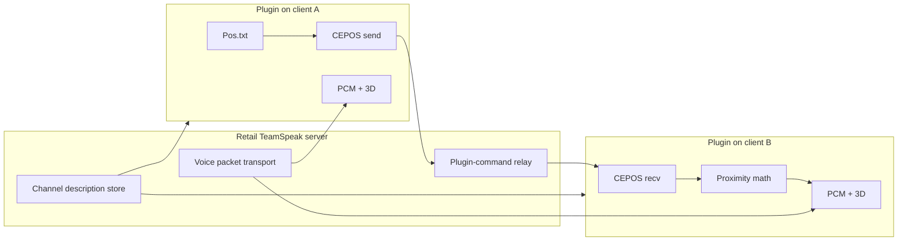

# Live V8 Plugin + Plugin API 26 — What We Have, What Is Server-Side, What Is Still Possible

Detailed inventory of the **current workspace plugin** (V8 / Client Plugin SDK, `PLUGIN_API_VERSION 26`) versus what the same SDK still allows that we do **not** use yet.

> [!IMPORTANT]
> This is **not** the discarded TeamSpeak 3 commercial ClientLib/ServerLib product.  
> Everything below is **retail TeamSpeak 3 Client + our DLL**.

---

## Table of contents

1. [One-sentence summary](#1-one-sentence-summary)
2. [Product and SDK identity](#2-product-and-sdk-identity)
3. [What the live plugin already does (full feature map)](#3-what-the-live-plugin-already-does-full-feature-map)
4. [What is already “server-side” today](#4-what-is-already-server-side-today)
5. [What is strictly client-side today](#5-what-is-strictly-client-side-today)
6. [APIs we already call (used subset of API 26)](#6-apis-we-already-call-used-subset-of-api-26)
7. [APIs available in API 26 that we do not use yet](#7-apis-available-in-api-26-that-we-do-not-use-yet)
8. [Realistic “send more to the server” options](#8-realistic-send-more-to-the-server-options)
9. [Hard limits — will never be Plugin-SDK server routing](#9-hard-limits--will-never-be-plugin-sdk-server-routing)
10. [Not implemented (product gaps)](#10-not-implemented-product-gaps)
11. [Recommended next steps](#11-recommended-next-steps)

---

## 1. One-sentence summary

The live plugin is a **TeamSpeak Client Plugin (API 26)** that reads Conan positions from a file, **relays them through the retail TeamSpeak server** as CEPOS plugin commands, lets each client **compute proximity locally**, and applies hearing via **PCM + 3D**. The retail server does **not** run our proximity math; it only relays commands and stores hub config in a channel description.

---

## 2. Product and SDK identity

| Item | Value in this workspace |
|---|---|
| Artifact | `conan_exiles.dll` loaded by retail TeamSpeak 3 |
| SDK | **Client Plugin SDK** (`sdk/README.md`) |
| API version | `PLUGIN_API_VERSION 26` in [`src/ts/entry/ts3_entry.c`](src/ts/entry/ts3_entry.c) |
| Headers | `sdk/include/ts3_functions.h` (`struct TS3Functions`) |
| Callbacks | `ts3plugin_*` exports in [`src/ts/entry/ts3_exports.h`](src/ts/entry/ts3_exports.h) |
| Not present | No `ts3client_*` / `ts3server_*` ServerLib/ClientLib product code |

---

## 3. What the live plugin already does (full feature map)

### 3.1 End-to-end data path

```text
Conan Exiles mod
  -> writes Pos.txt (x, y, z, yaw, ...)
Plugin pos watcher (pos_file.c)
  -> local position snapshot
CEPOS send (ts3_cepos.c)
  -> sendPluginCommand("CEPOS:<base64>")  ---via retail TS server---> all clients
CEPOS receive (onPluginCommandEvent)
  -> player_table_put
Proximity recompute (callback thread)
  -> distance, zones, voice mode, soundproof, reverb flags
  -> publish lock-free snapshots
PCM (onEditPlaybackVoiceDataEvent)
  -> gain / pan / lowpass / reverb on samples
3D (ts3_3d.c)
  -> systemset3DListenerAttributes + channelset3DAttributes
Hub profile (ts3_server_profile + hub_parser)
  -> read root channel description (server-admin policy)
Channel manage
  -> hub <-> ingame auto move (requestClientMove)
```

### 3.2 Game / position input

| Piece | Location | Behavior |
|---|---|---|
| Position file | `src/core/mod_file/pos_file.c` | Watcher polls ~30 ms; reads local player pose |
| Path detect | `path_detect.c` | Finds Conan `Pos.txt` / saved path |
| CEPOS packet | `ts3_cepos.h` | Fixed **56-byte** packed struct, wire-compatible since V7 |

**CEPOS fields (`CeposPacket`):**

```text
float x, y, z          // meters
float dirX, dirY, dirZ // look direction
float axisX,Y,Z        // up vector
float voiceDistance    // current mode range (meters)
char  playerName[16]
```

Wire: `CEPOS:` + base64. Throttle: min interval `PLUGIN_POLL_INTERVAL_MS`, position epsilon ~0.08 m, voice-distance epsilon ~0.05 m, keepalive ~1 Hz.

### 3.3 Proximity and audio (client)

| Piece | Location | Behavior |
|---|---|---|
| Player table | `player_table.c` | Fixed table (cap 512), LRU eviction |
| Math | `proximity_math.c` | Distance → volume / mute |
| Zones | `zone_resolve.c` + hub zones | Soundproof boundaries, reverb zones, distance overrides |
| Voice modes | `voice_modes.c` | Whisper / Normal / Shout + hotkeys; distance in CEPOS |
| PCM mix | `ts3_proximity_audio.c` | `onEditPlaybackVoiceDataEvent`: gain, pan, filters |
| 3D | `ts3_3d.c` | Listener + per-client 3D; custom rolloff callback |
| Unmute | adapter | `requestUnmuteClientsTemporary` so PCM still arrives |
| Volume reset | adapter | `setClientVolumeModifier` in unmute path |

### 3.4 Hub / channels (uses TeamSpeak server as config + lobby)

| Piece | Location | Behavior |
|---|---|---|
| Hub settings parse | `hub_parser.c` | Pure parse of channel description text |
| Apply/cache | `ts3_server_profile.c` | Fetch description, apply to runtime |
| Channel move | `channel_manage.c` | Auto hub ↔ ingame with cooldown / flood protection |
| Nick anonymize | `nick_anonymize.c` | Optional random nick when ingame (hub flag) |

**Hub keys already parsed from root channel description** ([`hub_parser.h`](src/core/hub/hub_parser.h)):

**`[GLOBAL]`**

- `AudioMaxVolume`, `AudioMinDistance`
- `MinimumWisper` / `MaximumWisper` (legacy spelling)
- `MinimumNormal` / `MaximumNormal`
- `MinimumShout` / `MaximumShout`
- `ForceDistanceBasedMuting`
- `ForceAutomaticChanelSwitching` (legacy spelling)
- `NicknameRandomizer`
- `RealisticAudio`
- `FilterIntensity` / `hubAudioFilterIntensity` (parsed **and** wired: `server_profile_get_filter_intensity()` blends cutoff / DRR / directional gain in `ts3_proximity_audio.c` — verified 2026-08-23; only the legacy global `hubAudioFilterIntensity` is dead code)
- `IngameChannelPassword`

**`[ZONES]` / per-zone**

- Quad corners `X1..Z4`, `GroundY` / `TopY`
- `SoundProof`, `Reverb`
- Distance overrides `Wisper` / `Normal` / `Shout`
- Optional volume / min-distance overrides

**`[RACE]`**

- Race name, `SteamID` lists, per-race whisper/normal/shout min/max, listen bonus

**`[DEFAULT_SETTINGS]`**

- First-connection default hotkeys / distances

### 3.5 UI / UX

| Piece | Behavior |
|---|---|
| F10 / Extras config | `showConfigInterface()` in `ui_main.c` (via dialog guard) |
| Overlay HUD | Voice mode / zone display |
| Hotkeys | Voice mode toggle |
| Presets | Voice distance presets UI |
| Chat/log helpers | print to chat / client log via adapter |

### 3.6 Threading (already enforced)

| Thread | Allowed | Forbidden |
|---|---|---|
| TS callback | All `TS3Functions`, CEDRAIN drain, CEPOS flush | Blocking work |
| Wakeup | Only `sendPluginCommand("CEDRAIN:1")` | Other TS API |
| PCM audio | Snapshot read + sample edit | TS API, locks |
| Pos watcher / UI | Flags + wakeup | Direct TS API |

### 3.7 Lifecycle callbacks implemented

From [`ts3_exports.h`](src/ts/entry/ts3_exports.h):

- Required: `name`, `version`, `apiVersion` (26), `author`, `description`, `setFunctionPointers`, `init`, `shutdown`, `registerPluginID`
- Config UI: `offersConfigure`, `configure`
- Events: `onConnectStatusChangeEvent`, `currentServerConnectionChanged`, `onPluginCommandEvent`, `onEditPlaybackVoiceDataEvent`, `onCustom3dRolloffCalculationClientEvent`, `onClientMoveEvent`, `onClientMoveMovedEvent`, `onChannelDescriptionUpdateEvent`, `onUpdateChannelEvent`, `onUpdateChannelEditedEvent`, `onTalkStatusChangeEvent`, `onHotkeyEvent`

---

## 4. What is already “server-side” today

Important: **“Server-side” here means “uses the retail TeamSpeak server”**, not “our code runs inside ts3server.”

| Mechanism | Where it lives | What the retail server does | What our plugin does |
|---|---|---|---|
| **CEPOS relay** | Plugin command | Relays `sendPluginCommand` to other clients | Build/parse CEPOS; store peers locally |
| **CEDRAIN** | Plugin command | Relays wakeup | Coalesce work onto callback thread |
| **Hub policy** | Root **channel description** | Stores admin text | Parse + apply ranges/zones/flags |
| **Channels** | Hub / ingame channels | Standard TS channel rules | Auto-move via `requestClientMove` |
| **Voice packets** | TS voice engine | Encode/transport/decode | Only edit playback after arrival |

```text
Server-admin writes hub config  -->  channel description on TS server
Plugin reads description        -->  policy (distances, zones, force flags)

Plugin A sends CEPOS            -->  TS server relays  -->  Plugin B/C/...
Each plugin computes proximity locally and mutes/attenuates PCM
```

**There is no server process of ours computing “A hears B.”**

---

## 5. What is strictly client-side today

- Distance / audible decision
- Soundproof / reverb application
- Voice-mode distance (after hub clamps)
- PCM gain / pan / filters
- 3D listener/speaker attributes
- Player table / recompute budgets
- Overlay HUD
- Local config (`g_config` / F10)

---

## 6. APIs we already call (used subset of API 26)

Through [`ts3_adapter.c`](src/ts/adapter/ts3_adapter.c) / wrappers:

| API | Purpose in V8 |
|---|---|
| `sendPluginCommand` | CEPOS + CEDRAIN |
| `requestUnmuteClientsTemporary` | Keep speakers unmuted for PCM hook |
| `setClientVolumeModifier` | Volume hygiene with unmute |
| `requestClientMove` | Hub ↔ ingame |
| `requestChannelDescription` / get description | Hub settings |
| Channel/client list + nickname getters | Channel manage / UI |
| `systemset3DSettings` | 3D global |
| `systemset3DListenerAttributes` | Listener pose |
| `channelset3DAttributes` | Per-speaker 3D |
| `printMessage` / `logMessage` | UX / diagnostics |
| set own nickname (self variables + flush) | Nick randomizer path |

---

## 7. APIs available in API 26 that we do not use yet

These exist in `sdk/include/ts3_functions.h` and are callable from a plugin (subject to **permissions** and server settings). None of them put Conan proximity **code** onto the retail server.

### 7.1 Strong candidates for “send/do more via TeamSpeak”

| API | What it could enable | Caveats |
|---|---|---|
| **More `sendPluginCommand` message types** | `CEAUTH`, `CEMODE`, richer state, versioned protocol | Still P2P via relay; spoofable; bandwidth |
| `requestClientSetWhisperList` | Client-requested whisper targets (admin overlay, special modes) | Not a proximity engine; whisper can disable normal channel talk; needs rights |
| `allowWhispersFrom` / whisper events | Accept whispered audio | Receiver allow-list UX |
| `setClientSelfVariableAsString` + `flushClientSelfUpdates` | Publish small self metadata (e.g. meta string) | Size limits; not a game backend; other clients must request/read |
| `requestClientVariables` | Refresh peer client variables | Still not positions unless we invent a convention |
| `requestSendPrivateTextMsg` / channel / server text | Discrete events, debug, light signaling | Noisy; not for 20 Hz positions |
| `requestMuteClients` / `requestUnmuteClients` | Persistent mute vs temporary | Heavy-handed; permissions; fights PCM design |
| `requestChannelSubscribe*` | Hear other channels | Lobby designs; not proximity |
| `requestClientPoke` | Attention / alerts | UX only |
| `requestClientKickFromChannel/Server` | Moderation helpers | Needs privileges; dangerous if abused |
| `requestConnectionInfo` | Latency/diagnostics | Ops/HUD |

### 7.2 Audio / device APIs we mostly skip

Playback/capture device enumeration, preprocessor config, wave-file playback, custom devices — possible for tools/FX, not for “server computes proximity.”

### 7.3 Channel management APIs unused

`requestChannelDelete`, `requestChannelMove`, temporary passwords, etc. — admin tooling only.

---

## 8. Realistic “send more to the server” options

Within **Plugin API 26 + retail TeamSpeak only**:

### Option A — Richer plugin-command protocol (recommended first)

Keep CEPOS; add versioned commands relayed by the TS server:

```text
CEPOS:  position (existing)
CEMODE: voice mode edge events
CEZONE: zone enter/leave (optional)
CEAUTH: soft identity hint (still spoofable)
CEPING: stale detection
```

**Server role:** still only relay. **Benefit:** cleaner peer sync, less polling noise, extensibility.

### Option B — More hub policy on the TeamSpeak server (recommended)

Expand root channel description schema (versioned keys):

- Feature flags, fail-closed policy, radio defaults (if added later)
- Documented schema; clients remain readers only

**Server role:** stores authoritative **policy** (admin-written). **Benefit:** true “server owns rules” without custom backend.

### Option C — Whisper lists for special overlays (experiment)

Use `requestClientSetWhisperList` for admin/global overlays — **not** as the main proximity router.

### Option D — Hybrid external authority (only if you need central compute)

```text
Clients -> your Voice Authority (not TS ServerLib)
Authority -> audible set
Plugin still applies PCM/3D
TeamSpeak -> voice transport + optional CEPOS
```

This is **not** “TeamSpeak server computes”; it is your process. Fail closed if authority is down.

---

## 9. Hard limits — will never be Plugin-SDK server routing

| Desire | With API 26 + retail TS? |
|---|---|
| Proximity math inside `ts3server` | **No** |
| Guarantee D never receives A’s voice packets | **No** (only local mute/PCM; packets still delivered in-channel) |
| Replace TeamSpeak with custom ServerLib host | Abandoned product direction |
| Trust client position as anti-cheat truth | **No** without Conan dedicated-server feed |

V8’s “everyone gets packets; we silence locally” is the Plugin-SDK ceiling for proximity hearing.

---

## 10. Not implemented (product gaps)

| Feature | Status |
|---|---|
| Radio system | Not present |
| Server-authoritative audible sets | Not present |
| Strong auth (Steam ticket → permissions) | Not present (only hub SteamID race lists) |
| `hubAudioFilterIntensity` fully wired to PCM | Done — `FilterIntensity` reaches the PCM path; only the same-named legacy global is unused |
| Commercial ServerLib custom app | Explicitly discarded |

---

## 11. Recommended next steps

1. **Freeze** current CEPOS + hub key inventory (this document).
2. Decide: **A-only** (better plugin commands + hub keys) vs **A + hybrid authority**.
3. Implement **one** additive change (Golden Rule): either one new plugin-command type **or** a small hub-schema extension.
4. Do **not** reopen ClientLib/ServerLib custom-app work.

---

## Quick reference: client vs server responsibilities (live V8)



---

*Related planning note: Plugin-SDK “send more to server” plan (Option B discarded). This file is the capability baseline for that work.*
